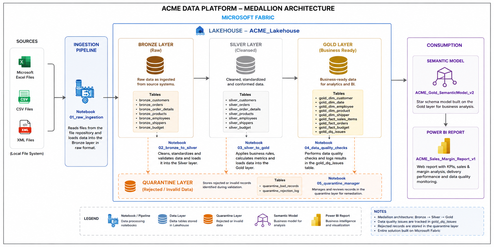

# ACME Inc. — Sales & Margin Analytics Platform

**Data Engineering | Microsoft Fabric Lakehouse | Medallion Architecture**

Author: Diego Brito · Pomerol
Reference Date: April 1, 2021 (data cutoff)  |  Document: June 2026

---

## Overview

This repository contains the full implementation of a data engineering solution built for ACME Inc., a clothing distributor operating across the United States and internationally. The objective was to design and deliver a scalable, governed analytics platform capable of supporting Sales and Margin analysis across multiple business dimensions — from executive dashboards down to individual product and customer-level insights.

The solution was built on Microsoft Fabric Lakehouse using a Medallion architecture with three data layers (Bronze, Silver, Gold), an automated data quality framework, and an insights layer driven by SQL queries and visualizations.

---

## Architecture



The platform follows the Medallion pattern — three distinct layers with clearly separated concerns:

**Bronze — Raw Ingestion**
Exact, immutable mirror of all source files. No transformations. Full lineage tracking via `_ingested_at` timestamp on every table. Any reprocessing requirement always starts here.

**Silver — Trusted Data**
Typed, cleaned, and enriched. All known source errors corrected. Geographic enrichment applied. Invalid records routed to a quarantine table rather than silently dropped. This is the single source of truth for any downstream consumption.

**Gold — BI-Ready Star Schema**
A Constellation Schema with two line-level fact tables, one budget fact, and five conformed dimensions. Metrics computed at the correct grain. Connected to Power BI via Direct Lake.

---

## Data Sources

| Format | File | Bronze Table | Rows |
|--------|------|--------------|------|
| CSV | Orders.csv | bronze_orders | 6,571 |
| CSV | Order_Details.csv | bronze_order_details | 17,032 |
| CSV (3 files merged) | Shipments01/02/03.csv | bronze_shipments | 17,226 |
| CSV | Customers.csv | bronze_customers | 100 |
| CSV | Products.csv | bronze_products | 77 |
| CSV | Categories.csv | bronze_categories | 10 |
| CSV | Divisions.csv | bronze_divisions | 6 |
| CSV | Shippers.csv | bronze_shippers | 3 |
| XML | Suppliers.xml | bronze_suppliers | 29 |
| Excel (2 sheets) | Employees Offices.xlsx | bronze_employees + bronze_offices | 35 + 5 |
| Excel | Budget.xlsx | bronze_budget | 8 |

---

## Repository Structure

```
acme-lakehouse-poc/
├── README.md                          Project overview and executive summary
├── WALKTHROUGH.md                     Technical walkthrough — layer by layer
├── notebooks/
│   ├── NB_00_Documentation_v2.ipynb   Architecture documentation and system guide
│   ├── NB_01_Bronze_Ingestion_v2.ipynb     Raw ingestion pipeline
│   ├── NB_02_Silver_Transformation_v2.ipynb Cleansing and enrichment pipeline
│   ├── NB_03_Gold_StarSchema_v2.ipynb      Star schema build
│   ├── NB_04_Data_Quality_v2.ipynb         Data quality checks
│   ├── NB_05_Insights_SQL_v2.ipynb         SQL-driven business insights
│   └── NB_06_Orchestration_v2.ipynb        Fabric Data Pipeline orchestration
└── docs/
    ├── ACME_Architecture_OnePager.pdf      One-page architecture reference
    ├── ACME_DE_POC_Presentation.pptx       Full project presentation
    └── images/
        ├── medallion-architecture.png      Architecture diagram
        ├── nb05-analysis-output-full.png   Notebook output — sections 1-12
        └── nb05-analysis-output-section13.png  Notebook output — section 13 (SCD analysis)
```

---

## Notebook Execution Order

The notebooks are designed to run sequentially. Each layer depends on the previous one completing successfully.

```
NB_01  →  NB_02  →  NB_03  →  NB_04  →  NB_05
Bronze    Silver    Gold       DQ         Insights
```

In production, this chain is orchestrated via a Fabric Data Pipeline with activity-level dependency enforcement. Each notebook runs only if its predecessor completed without error.

---

## Gold Layer — Star Schema

```
                    [gold_fact_budget]
                     40 rows | emp x year
                           |
[gold_dim_date]    [gold_fact_sales_items]    [gold_dim_employee]
2007-2021           17,032 rows | line grain   35 + Unknown (-1)
      |                    |                         |
[gold_dim_customer]  [gold_fact_orders]      [gold_dim_shipper]
100 customers + geo  6,571 rows | order grain  3 + Unknowns 4,5
      |
[gold_dim_product]
77 products | cat + supplier + margin bands
```

**Key metrics computed in Gold:**

| Metric | Formula | Note |
|--------|---------|------|
| SalesAmount | Qty x HistoricalUnitPrice x (1 - Discount) | Uses transaction price |
| GrossMargin | SalesAmount - (Qty x CurrentUnitCost) | Known limitation: current cost used |
| GrossMarginPct | GrossMargin / SalesAmount x 100 | Row-level only |
| TotalOrderValue | TotalProductSales + Freight | Order grain |
| BudgetMonthly | BudgetAmount / 12 | Enables month-level comparison |
| DeliveryDays | ShipmentDate - OrderDate | Negative — see DQ findings |

---

## Data Quality Findings

Nine checks were implemented across three tables. Results are persisted in `gold_dq_issues` for governance and BI consumption.

**Critical findings:**

- `TotalOrder = $0` for all 6,571 orders in the source — recomputed from Order_Details
- `ShipmentDate` ranges 2007–2012 while `OrderDate` ranges 2016–2021 — temporally impossible, data from a legacy migration. Delivery SLA cannot be calculated.
- `ShipperIDs 4 and 5` referenced in 20% of orders with no record in Shippers master data
- `DivisionID = 2` duplicated for both North America and Central America — primary key violation

**Notable behavioral patterns (not errors):**

- `unitprice_discrepancy` (17,816 records, Info) — expected SCD behavior: sale price at transaction time differs from current catalog price
- `shipment_employee_mismatch` (~3,400 records, Medium) — shipments processed by a different employee than the one who took the order. Impacts Sales Rep reporting accuracy.

---

## Insights Notebook — Coverage

`NB_05` delivers 13 SQL-driven analytical sections covering all required business dimensions:

| Section | Topic |
|---------|-------|
| 1 | Sales Year-over-Year |
| 2 | Top 10 Products by Revenue and Margin |
| 3 | Sales by Division and Region |
| 4 | Budget vs Actual by Sales Rep |
| 5 | Gross Margin Distribution by Price Tier |
| 6 | Top 10 Customers by Revenue |
| 7 | Seasonal Sales Pattern — Month x Year Heatmap |
| 8 | Data Quality Summary |
| 9 | Drill-Down: Product Line to Product to Customer |
| 10 | Quantity Sold vs Sales — All Dimensions |
| 11 | Customers YTD vs LY YTD |
| 12 | Delivery Performance — Legacy Data Issue |
| 13 | UnitPrice in Two Tables — SCD Pattern Explained |


---

## Consultant Recommendations

**Immediate — Before Go-Live:**

1. Fix `DivisionID = 2` in the source Divisions file — Central America requires a unique identifier
2. Engage the logistics team on Shipments data — the 2007–2012 dates make SLA analysis impossible with current data
3. Register ShipperIDs 4 and 5 in the shippers master file
4. Clarify with Finance whether Freight is part of Gross Revenue or a pass-through cost

**Short Term — Next Sprint:**

5. Implement SCD Type 2 on the Products table — add `Valid_From`, `Valid_To`, `Is_Current` to track catalog price history and enable accurate historical margin calculation
6. Integrate a current shipments data source to enable real delivery SLA analysis
7. Migrate the pipeline to incremental loads using MERGE/UPSERT for production-grade idempotency
8. Add automated alerts on `bronze_quarantine` for the data governance team

---

## Business Opportunities Identified

- **Seasonality:** Order concentration in specific months is visible in the data. Pre-season inventory planning can reduce both stockout risk and carrying costs.
- **Inactive customers:** Two registered customers have never placed an order. A targeted activation campaign carries low cost and measurable upside.
- **Stockout risk:** Products with zero inventory and open orders exist in the current catalog. Immediate supply chain intervention is warranted.
- **Supply chain concentration:** Supplier geography is heavily clustered. The single-point-of-failure risk is quantifiable and can inform a diversification strategy.

---

## Technical Notes

- All source files were ingested without modification. No transformations were applied to the raw data.
- The `clean_cols()` function is applied to all ingested DataFrames to ensure Delta Lake column name compatibility.
- The `bronze_quarantine` table accumulates all rejected records across pipeline runs, enabling full audit history.
- `gold_dq_issues` is designed for direct consumption by Power BI — the governance dashboard reads from it without any additional transformation.
- GrossMargin uses current `UnitCost` from the Products table. Until SCD Type 2 is implemented, historical margin figures carry the caveat that cost changes between 2016 and 2021 are not reflected.

---

Diego Brito · Pomerol · June 2026
