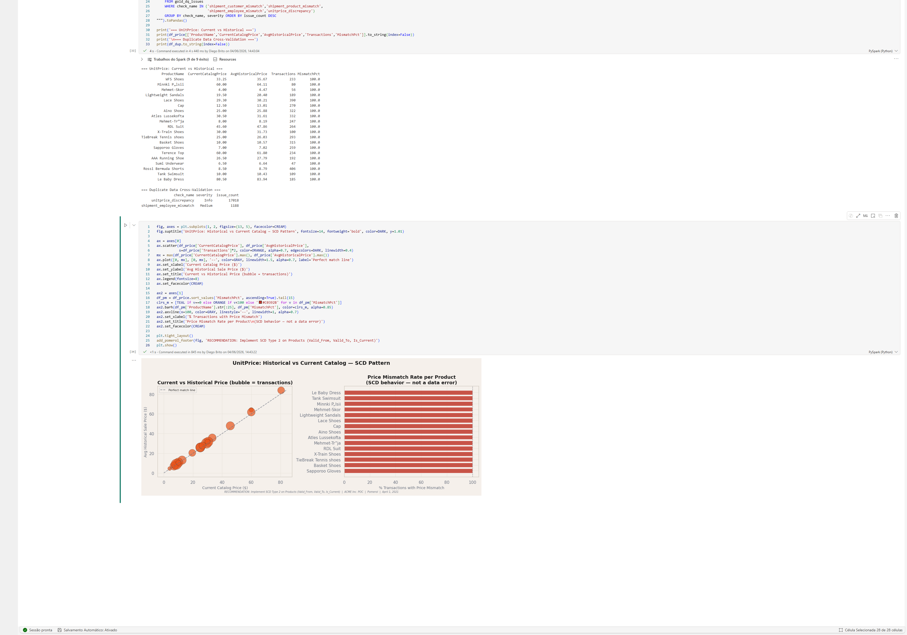

# Technical Walkthrough
## ACME Inc. — Data Engineering Platform on Microsoft Fabric

Author: Diego Santiago Vieira de Brito
Last updated: April 1, 2021 (reference date)

---

This document provides a layer-by-layer technical walkthrough of the pipeline implementation. It is intended for data engineers and technical reviewers who need to understand the design decisions, code patterns, and known edge cases across all five notebooks.

---

## Environment

- **Platform:** Microsoft Fabric Lakehouse
- **Runtime:** Synapse PySpark (Fabric native)
- **Storage:** OneLake — Delta Lake format
- **Semantic model:** Direct Lake connection (no import, no refresh latency)
- **Orchestration:** Fabric Data Pipeline with notebook activity chain

---

## Notebook 01 — Bronze Ingestion

**File:** `NB_01_Bronze_Ingestion_v2.ipynb`

**Purpose:** Ingest all source files as Delta tables with zero transformation. Bronze is an append-only audit layer.

### Design decisions

**Column sanitization**

All DataFrames pass through `clean_cols()` before writing to Delta. This replaces spaces and special characters in column names that would otherwise break Delta Lake schema enforcement.

```python
def clean_cols(df):
    new_cols = [re.sub(r'[ ,;{}()\n\t=]', '_', c).strip('_') for c in df.columns]
    for old, new in zip(df.columns, new_cols):
        if old != new:
            df = df.withColumnRenamed(old, new)
    return df
```

This function is applied to every DataFrame — CSV, XML, and Excel alike. Early versions only applied it to the Employee/Office Excel sheets (which have column names with spaces). The v2 fix extends it universally.

**Encoding**

Source CSV files use Windows-1252 encoding. Without the explicit encoding option, Spark defaults to UTF-8 and silently garbles characters above ASCII 127 — primarily affecting city names and contact names in European customer records.

```python
spark.read
    .option("encoding", "windows-1252")
    .csv(f"{BASE_PATH}/{subfolder}/")
```

**Shipments — multi-file merge**

Three separate Shipments CSV files are read from a single directory in one Spark read operation. Spark's wildcard reader handles the merge automatically. The `_source_file` column is added to preserve file-level lineage.

```python
df_ship = (spark.read
             .option("header", True)
             .option("inferSchema", True)
             .option("encoding", "windows-1252")
             .csv(f"{BASE_PATH}/shipments/"))
df_ship = clean_cols(df_ship)
df_ship = df_ship.withColumn("_source_file", input_file_name())
```

**XML ingestion**

The Suppliers XML file has no native Spark XML reader available in this environment. The file is read using Python's `xml.etree.ElementTree` and converted to a list of dicts before creating a Spark DataFrame. Each child tag of the root element becomes a column.

**Budget Excel**

The Budget.xlsx file has a title row ("QWT Budget") on row 1. Real column headers are on row 2. `header=1` in pandas handles this. All columns are ingested as strings — type casting happens in Silver.

**Lineage**

Every table receives `_ingested_at = current_timestamp()` as the last column. This enables point-in-time debugging and incremental load planning in a future production implementation.

---

## Notebook 02 — Silver Transformation

**File:** `NB_02_Silver_Transformation_v2.ipynb`

**Purpose:** Produce typed, clean, enriched, and governed data. Silver is the single source of truth. No business logic belongs here.

### Geographic enrichment

A geographic reference table is defined in-memory at the top of the notebook. It maps every Country to a `DivisionID`, `Continent`, `SubRegion`, and `ISO2` code. This reference was built manually to resolve a critical source problem: the Divisions master file had a primary key violation (DivisionID = 2 assigned to both North America and Central America).

The geographic reference re-derives DivisionID from Country at the customer level, bypassing the broken source field entirely.

```python
geo_ref = [
    ("USA", 2, "Americas", "North America", "US"),
    ("MEXICO", 6, "Americas", "Central America", "MX"),  # remapped
    ...
]
```

Mexico was remapped to DivisionID = 6 (the new ID assigned to Central America after the duplicate was quarantined).

### Quarantine framework

Invalid records are never silently dropped. The `quarantine()` function appends them to `bronze_quarantine` with metadata columns describing the failure.

```python
def quarantine(df, check_name, source_table, reason):
    df_bad = (df
        .withColumn("_quarantine_reason", lit(reason))
        .withColumn("_quarantine_check",  lit(check_name))
        .withColumn("_quarantine_source", lit(source_table))
        .withColumn("_quarantined_at",    current_timestamp())
    )
    df_bad.write.format("delta").mode("append").option("mergeSchema", True).saveAsTable("bronze_quarantine")
```

The table accumulates across pipeline runs (append mode), making it a full audit log of every rejected record since the first ingestion.

### Key source error corrections

**DivisionID duplicate — primary key violation**

A window function deduplicates on `DivisionID`, keeping the first occurrence and quarantining the rest.

```python
w = Window.partitionBy("DivisionID").orderBy(monotonically_increasing_id())
df_div = df_div.withColumn("_rn", row_number().over(w))
df_dupes = df_div.filter(col("_rn") > 1).drop("_rn")
quarantine(df_dupes, "duplicate_primary_key", "bronze_divisions", ...)
```

Central America is then injected as a new record with ID = 6.

**Unknown Member injection**

Three separate Unknown Member records are injected to preserve referential integrity:
- `EmployeeID = -1` in `silver_employees` — covers 5 orders with no assigned sales rep
- `ShipperID = 4` and `ShipperID = 5` in `silver_shippers` — cover approximately 20% of orders with no matching shipper

Without these injections, those records would produce NULL dimension joins in Gold and orphaned financial values in Power BI.

**IEEE 754 floating-point artifacts in Discount**

The source system stored discount values as IEEE 754 doubles, producing values like `0.050000001` instead of `0.05`. All Discount values are rounded to 2 decimal places before any downstream calculation.

```python
.withColumn("Discount", round(col("Discount").cast("double"), 2))
```

**Date parsing**

Order and Shipment dates use the format `M/d/yyyy` — month and day without zero-padding. Spark's default date parsing fails silently on this format, producing NULL dates across all rows.

```python
.withColumn("OrderDate", to_date(col("OrderDate"), "M/d/yyyy"))
```

**Budget — forward-fill and unpivot**

The Budget Excel file stores office assignments in merged cells. When read into a DataFrame, merged cell content appears only in the first row of the merge, with NULLs below. A window-based forward-fill resolves this before unpivoting from wide to long format.

```python
w_ffill = Window.orderBy(monotonically_increasing_id()).rowsBetween(Window.unboundedPreceding, 0)
df_filled = df_bud_raw.withColumn("Office",
    last(col("Office"), ignorenulls=True).over(w_ffill))
```

The `stack()` SQL function then unpivots the year columns into a long-format fact table.

**Shipment date anomaly**

All 17,226 shipment records carry dates from 2007–2012. All corresponding orders are dated 2016–2021. This is a legacy system migration artifact — the shipment data was exported from a system that was active years before the order data was created. It is not fixable at the pipeline level. A `_data_warning` column is added to every row documenting this issue.

```python
.withColumn("_data_warning",
    lit("ShipmentDate (2007-2012) predates OrderDate (2016-2021) for all records. "
        "Data from legacy system. Delivery SLA is not reliable."))
```

---

## Notebook 03 — Gold Star Schema

**File:** `NB_03_Gold_StarSchema_v2.ipynb`

**Purpose:** Build the final BI-ready model. All business logic and metric computation happens here.

### Schema pattern

The Gold layer implements a Constellation Schema — two fact tables sharing conformed dimensions. This pattern was chosen over a single merged fact because the two facts operate at different grains:

- `gold_fact_sales_items` — one row per order line. Freight excluded (order-level cost, not line-level).
- `gold_fact_orders` — one row per order. Freight and TotalOrderValue computed here. DeliveryDays computed here.

Combining these grains into a single table would require either duplicating freight across lines (inflating totals) or nullifying it on line rows (losing it from line-level queries). Separating them eliminates both problems.

### Dimension — dim_date

Generated programmatically to cover both the order period (2016–2021) and the shipment period (2007–2012). Without the earlier dates, shipment date keys would fail to resolve in the model.

Fiscal year starts in April, consistent with the reference date of April 1, 2021 (the last sale on March 30, 2021 falls in FY2020, not FY2021).

### Grain and key metric formulas

**SalesAmount** — uses the historical transaction price from `order_details.UnitPrice`, not the current catalog price from `products.UnitPrice`. This is the correct approach for financial reporting. The two prices differ in 99.4% of rows.

```python
col("LineTotal").alias("SalesAmount")
# LineTotal = Quantity * order_details.UnitPrice * (1 - Discount)
```

**GrossMargin** — uses the current `UnitCost` from the Products table. This is a known limitation: if product costs changed between 2016 and 2021, the historical margin figures are inaccurate. Resolving this requires SCD Type 2 on the Products table.

```python
spark_round(col("LineTotal") - (col("Quantity") * col("UnitCost")), 2).alias("GrossMargin")
```

**GrossMarginPct** — row-level metric only. Averaging this column in Power BI produces an incorrect result. Correct aggregate margin requires `DIVIDE(SUM(GrossMargin), SUM(SalesAmount))` in DAX.

**DeliveryDays** — computed as `ShipmentDate - OrderDate` via `datediff()`. Results are negative for all rows due to the legacy date issue. The column is retained in the model with a `ShipmentDataWarning` flag rather than being dropped — the anomaly itself is meaningful data for the client.

### Old table cleanup

The notebook explicitly drops `gold_fact_sales` if it exists from any previous version run.

```python
spark.sql("DROP TABLE IF EXISTS gold_fact_sales")
```

---

## Notebook 04 — Data Quality

**File:** `NB_04_Data_Quality_v2.ipynb`

**Purpose:** Run all quality checks and persist results to `gold_dq_issues` for BI consumption.

### Check categories

**Referential integrity** — five checks using `left_anti` joins to identify orphaned records:

```python
orphan_od = df_od.join(ord_ids, "OrderID", "left_anti")
```

**Business consistency** — two checks on known anomalies:
- `shipment_before_order` — quantifies the legacy date problem. Expected to fire for all 17,226 shipment rows.
- `unitprice_discrepancy` — documents the SCD pricing pattern. Expected at ~17,816 rows. Severity = Info.

**Shipments cross-validation** — three checks comparing the redundant dimension keys in Shipments against the authoritative source in Orders and Order_Details:

```python
df_cross = (df_ship
    .join(df_ord.select("OrderID",
                        col("CustomerID").alias("ord_CustID"),
                        col("EmployeeID").alias("ord_EmpID")), "OrderID", "left")
    .join(df_od.select("OrderID","LineNo",
                        col("ProductID").alias("od_ProdID")), ["OrderID","LineNo"], "left"))
```

If any mismatch exists in `shipment_customer_mismatch`, `shipment_product_mismatch`, or `shipment_employee_mismatch`, a shipment was processed using different data than the original order — a data integrity concern with direct impact on commission attribution and order-level reporting.

### Output schema

All checks produce a uniform schema before being unioned into `gold_dq_issues`:

```
check_name  string
severity    string  (Critical / High / Medium / Info)
table_name  string
key_value   string
description string
_checked_at timestamp
```

The advanced audit section at the end explicitly separates known issues (`shipment_before_order`, `unitprice_discrepancy`) from unexpected anomalies, making the governance output useful for stakeholders without requiring them to understand the legacy data context.

---

## Notebook 05 — Business Insights

**File:** `NB_05_Insights_SQL_v2.ipynb`

**Purpose:** Answer all required business questions using SQL against the Gold layer, with seaborn/matplotlib visualizations.

### Query pattern

All queries follow the same structure: read from Gold tables using `spark.sql()`, convert to pandas with `.toPandas()`, visualize with matplotlib/seaborn.

```python
df = spark.sql("""
    SELECT ...
    FROM gold_fact_sales_items fi
    JOIN gold_dim_product p ON fi.ProductID = p.ProductID
    ...
""").toPandas()
```

Margin aggregation always uses the correct formula to avoid the GrossMarginPct averaging trap:

```python
ROUND(SUM(fi.GrossMargin) / NULLIF(SUM(fi.SalesAmount), 0) * 100, 1) AS MarginPct
```

The `* 100 / COUNT(...)` ordering (multiply before divide) is used in percentage calculations to minimize floating-point rounding error propagation, consistent with Spark's own advisor recommendation.

### Section 13 — UnitPrice in two tables

The query for Section 13 joins `silver_order_details`, `silver_products`, and `silver_categories`. The `CategoryName` column does not exist in `silver_products` (which contains only `CategoryID`) — it requires an explicit join to `silver_categories`.

```python
FROM silver_order_details od
JOIN silver_products   p   ON od.ProductID  = p.ProductID
JOIN silver_categories cat ON p.CategoryID  = cat.CategoryID
```

This is the correct version. Omitting the `silver_categories` join produces an `UNRESOLVED_COLUMN` error on `p.CategoryName`.

### Visual output




---

## Known Limitations

| Limitation | Impact | Resolution |
|------------|--------|------------|
| GrossMargin uses current UnitCost | Historical margins inaccurate if costs changed | SCD Type 2 on Products |
| Shipment SLA not measurable | DeliveryDays all negative | Replace with current shipments data source |
| Pipeline is full-reload | Not production-grade for large volumes | Implement MERGE/UPSERT incremental pattern |
| No data freshness tracking | Semantic model has no last-refreshed indicator | Add `_pipeline_run_id` or watermark column |
| Budget data limited to known years | Future years require source file updates | Extend Budget.xlsx or connect to finance system |

---

## Running the Pipeline

1. Upload source files to the Lakehouse file repository under `Files/bronze/{source_name}/`
2. Open and run notebooks in order: NB_01 → NB_02 → NB_03 → NB_04 → NB_05
3. Alternatively, trigger the Fabric Data Pipeline — it enforces execution order via activity dependencies

Each notebook is idempotent. Re-running any notebook overwrites its target tables without side effects, except for `bronze_quarantine` which accumulates records across runs by design (append mode).

---

Diego Santiago Vieira de Brito
